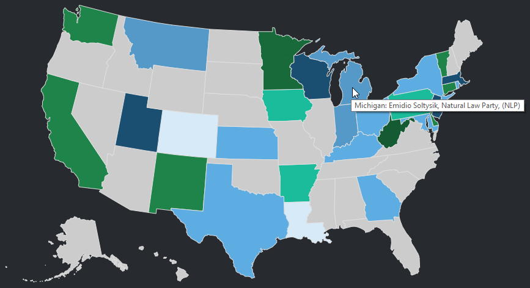
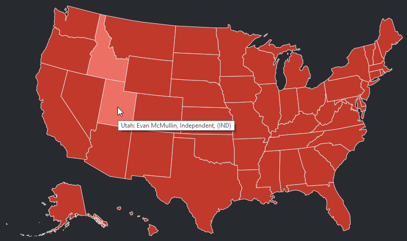
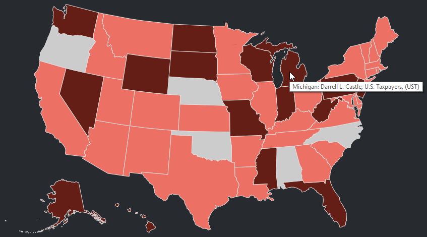

# Election Insights

Most election maps show only red or blue states -- victories gained by one of two candidates. More often than not, however, there are multiple presidential candidates on a ballot. This app answers questions such as,

- "What are the results if all votes for left-leaning candidates are compared to all votes for right-leaning candidates?" 
- "What is the result if votes for all right-leaning candidates are compared to the winning left-leaning candidate?"

For example, if all "Left wing" candidates combined their votes, could they have collectively defeated Trump?

At present, I'm using only the popular vote for each state. Electoral College data coming soon.

## Languages

- Python scripts for downloading data and scraping data sources 
- MySQL to create new tables
- D3.js for data viz

## Note

- The Electoral College values change in some elections
- The same candidate in different states may run in a different party

## Examples

Above includes every candidate -- but, of course, only President Trump and Secretary Clinton are displayed on the map as winners.

Above shows slightly different results if we combined all the "left" candidates versus President Trump.

However, if we also combine "right" candidates as well for a Left vs Right battle royale:

The Left gains Wisconsin.

Below shows results if only socialist candidates [except for Jill Stein (Green Party)] ran. Gray states are those with no socialist candidates (or there were socialist candidates but they received zero votes).

Below displays only Right candidates excluding President Trump.

So, all right-leaning candidates excluding both President Trump and Johnson (Libertarian):

### Future

- Menu will be dynamic. Only candidates used for map will appear in legend. A candidate may appear in the legend but not in the map because they were a candidate in a state but they did not win.
- User will be able to click candidate(s) in the legend to add or remove them from map.

## Schema

Like the U.S. Constitution, this schema is a living document and evolves over time.

## Note to Self
Check this out

http://election.princeton.edu/for-fellow-geeks/
